# NeRF: Neural Radiance Field

Efficient and comprehensive pytorch implementation of [NeRF: Representing Scenes as Neural Radiance Fields for View Synthesis](https://arxiv.org/abs/2003.08934) from Mildenhall et al. 2020.

<p align="center">
  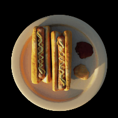
  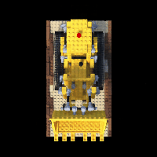
  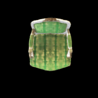
  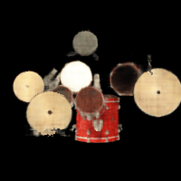
  
  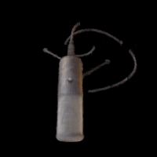
  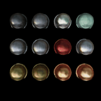
  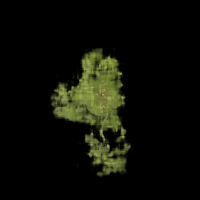
  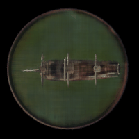
</p>

*Table of Content*
- [Installation](#installation)
- [Quickstart](#quickstart)
- [Description](#description)
  - [Positional Encoding](#positionalencoding)
  - [Implicit Representation](#implicitrepresentation)
  - [Volume Rendering](#volumerendering)
- [Implemenation](#implementation)
- [Citation](#citation)


<span id="installation"></span>
## Installation

This implementation has been tested on `Ubuntu 20.04` with `Python 3.8`, and `torch 1.9`.
Install required package first `pip3 install -r requirements.txt`.
You may use `pyenv` or `conda` to avoid confilcts with your environement.

Download the [Blender Scenes Dataset](https://drive.google.com/file/d/18JxhpWD-4ZmuFKLzKlAw-w5PpzZxXOcG/view?usp=sharing).
Rename it and place it in the repo as `data/blender` *([ingored](.gitignore) by default)*.

```txt
data/
└── blender
    ├── chair
    ├── drums
    ├── ficus
    ├── hotdog
    ├── lego
    ├── materials
    ├── mic
    └── ship
```


<span id="quickstart"></span>
## Quickstart

*Jupyter Notebook*

You first need to activate [Jupyter Notebook Widgets](https://ipywidgets.readthedocs.io/en/latest/user_install.html).
Then, start the [nerf.ipynb](nerf.ipynb) notebook `jupyter notebook nerf.ipynb`.
Run all the Cells and you will be granted with GUIs allowing you to configure, train and perform inference on `Blender Scenes Dataset`.

*Manual*

```python
# ==== Imports
import nerf.infer         # Enables inference features (NeRF.infer)
import nerf.train         # Enables training features (NeRF.fit)

from nerf.core import BoundedVolumeRaymarcher as BVR, NeRF
from nerf.core import PositionalEncoding as PE
from nerf.core import NeRFScheduler
from nerf.data import BlenderDataset


DEVICE = "cuda:0"

# ==== Setup
dataset = BlenderDataset("./data/blender", scene="hotdog", split="train")

phi_x = PE(3, 6)
phi_d = PE(3, 6)

nerf = NeRF(phi_x, phi_d, width=256, depth=4).to(DEVICE)
raymarcher = BVR(tn=2., tf=6., samples_c=64, samples_f=64)

# ==== Train
history = nerf.fit(
    nerf,                 # NeRF Module
    raymarcher,           # Raymarcher (BVR)
    optim,                # Optimizer (Adam, AdamW, ...)
    scheduler,            # NeRFScheduler
    criterion,            # Criterion (MSELoss, L1Loss, ...)
    scaler,               # GradScaler (torch.cuda.amp, can be disabled)
    dataset: Dataset,     # Dataset (BlenderDataset)
)                         # More options available (epochs, batch_size, ...)

# ==== Infer
frame = nerf.infer(
    nerf,                 # NeRF Module
    raymarcher,           # Raymarcher (BVR)
    ro,                   # Rays Origin (Tensor of size (B, 3))
    rd,                   # Rays Direction (Tensor of size (B, 3))
    W,                    # Frame Width
    H,                    # Frame Height
)                         # More options available (epochs, batch_size, ...)
```


<span id="description"></span>
## Description

NeRF uses both advances in Computer Graphics and Deep Learning research.

The method allows encoding a 3D scene as a continuous volume described by density and color at any point in a given bounded volume.
During raymarching, the rays query the volume representation model to obtain intersection data.
It is trained in an end-to-end fashion and uses only the ground truth images as an objective signal.
A first network, the coarse model, is trained using voxel grid sampling to increase sample efficiency.
This first pass is used to trained a second network, the fine network, using importance sampling of the volume.

The networks are tied to one unique scene.
Caching and acceleration structures can be used to decrease rendering time during inference.
The same models can be used to generate a depth map and a 3D mesh of the scene.


<span id="positionalencoding"></span>
### Positional Encoding

*Fourier Features*
In their original work, Midenhall et al. presented the use of positional encoding to allow the network to learn high-frequency functions which clasical multilayer perceptron without positiona encoding are not able to and focus only on low-frequency reconstruction.

```python
v = xy | xyz                      # normalized to [-1; 1]

rgb = lambda v: mlp(v)            # wo/ pe-encoding
rgb = lambda v: mlp(phi(v))       # w/  pe-encoding

phi = lambda v: [
  cos(2 ** 0 * PI * v),
  sin(2 ** 0 * PI * v),
  cos(2 ** 1 * PI * v),
  sin(2 ** 1 * PI * v),
  ...
].T
```

*Fourier Features*
In [Fourier Features Let Networks Learn High Frequency Functions in Low Dimensional Domains](https://arxiv.org/abs/2006.10739), Tancik et al 2020, NeRF authors have shown that encoding positions using fourier feature mapping enables multilayer perceptron to learn high-frequency functions in low dimensional problem domains.

```python
v = xy | xyz                      # normalized to [-1; 1]

rgb = lambda v: mlp(v)            # wo/ ff-encoding
rgb = lambda v: mlp(phi(v))       # w/  ff-encoding

phi = lambda v: [
  a_0 * cos(2 * PI * b_0.T * v),
  a_0 * sin(2 * PI * b_0.T * v),
  a_1 * cos(2 * PI * b_1.T * v),
  a_1 * sin(2 * PI * b_1.T * v),
  ...
].T
```


<span id="implicitrepresentation"></span>
### Implicit Representation

The scene is encoded by feating a simple multilayer perceptron architecture on density `sigma` and color `RGB` given position `x` and direction `d` queries.

*Original Architecture*
```txt
n = 4

           ReLU    ReLU    
phi(x) --> 256 --> 256 --> ReLU(sigma)
  60    |   n   ^   n  |
        |       |      |           ReLU
        -- cat --      --> 256 --> 128 --> Sigmoid(RGB)
                                ^
                                |
                               cat
                                |
                              phi(d)
                                24
```


<span id="volumerendering"></span>
### Volume Rendering

Volume raymarching is used to produce the final rendering.
Each ray is thrown from the camera origin to each pixel and sampled `N_c` times for the coarse model and `N_f` times for the fine model between a given bounded volume delimited by the near `t_n` and far `t_f` camera frustum parameters.

*Rendering Equation*
```python
N_c, N_f = 64, 128

alpha_i = (1 - exp(-sigma_i * delta_i))
T_i = cumprod(1 - alpha_i)
w_i = T_i * alpha_i
C_c = sum(w_i * c_i)
```

In this equation, `w_i` respresents a piecewise-constant PDF along the ray, `T_i` the amount of light blocked before reaching segment `t_i`, `delta_i` the segment length `dist(t_i-1, t_i)`, and `c_i` the color of the ray intersection at `t_i`.

The weights `w_i` are reused for inverse transform sampling for the fine pass.
A total of `N_c + N_f` is finally used to generate the last render, this time querying the coarse model instead.


<span id="implementation"></span>
## Implementation (WIP)

*Status (WIP)*
- [x] Fourier Featrure Encoding
- [x] Positional Encoding
- [x] Neural Radiance Field Model
- [x] Bounded Volume Raymarcher
- [x] Noise for Continuous Representation
- [x] Camera Paths (Turnaround, ...)
- [x] Interactive Notebook
- [x] Meta-Learning as in [Tanick et al.](https://arxiv.org/abs/2012.02189) (see [Nichol et al.](https://arxiv.org/abs/1803.02999))
- [x] Shifted Softplus for Sigma as in (see [Barron et al.](https://arxiv.org/abs/2103.13415))
- [x] Widened Sigmoid for RGB as in (see [Barron et al.](https://arxiv.org/abs/2103.13415))
- [x] Fine Network (Differ from Original: No second Network)
- [x] Training Opitmizations (see [Nvidia's PyTorch Performance Tuning Guide](https://nvlabs.github.io/eccv2020-mixed-precision-tutorial/))
- [x] Safe Sofplus, Sigmoid (see [Blog Article by Jia Fu Low](https://jiafulow.github.io/blog/2019/07/11/softplus-and-softminus/))
- [x] Gradient Clipping
- [x] NeRF/JAX-NeRF Warmup Decay Leanring Rate Scheduler (see [Barron et al.](https://arxiv.org/abs/2103.13415))
- [ ] Knowledge Distillation (see Teacher-Student Methods)
- [ ] Quantization

*Results (WIP)*
|Scene|Ground Truth|NeRF RGB Map|NeRF Depth Map|
|:----|:----------:|:--------:|:-----------------:|
|Chair|||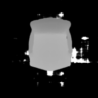|
|Lego|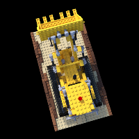||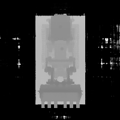|
|HotDog|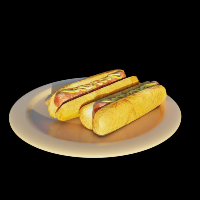||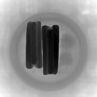|
|Drums|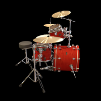||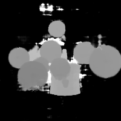|
|Mic|||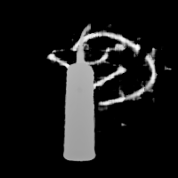|
|Materials|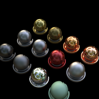||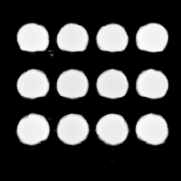|
|Ficus|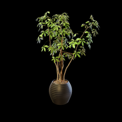||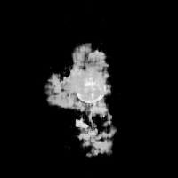|
|Ship|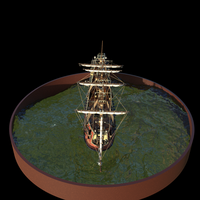|||


<span id="citation"></span>
## Citation

*Original Work*
```txt
@inproceedings{mildenhall2020nerf,
  title={NeRF: Representing Scenes as Neural Radiance Fields for View Synthesis},
  author={Ben Mildenhall and Pratul P. Srinivasan and Matthew Tancik and Jonathan T. Barron and Ravi Ramamoorthi and Ren Ng},
  year={2020},
  booktitle={ECCV},
}
```